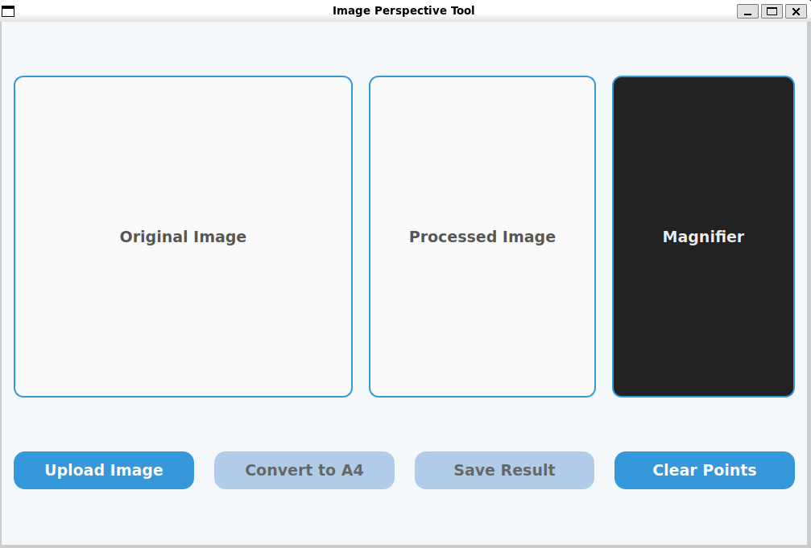
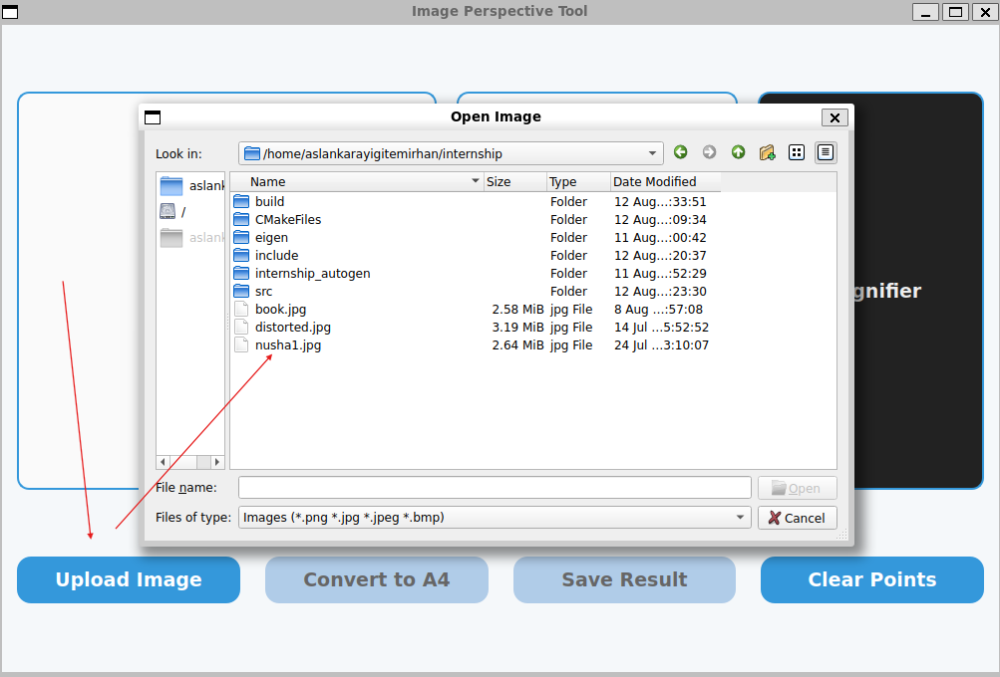
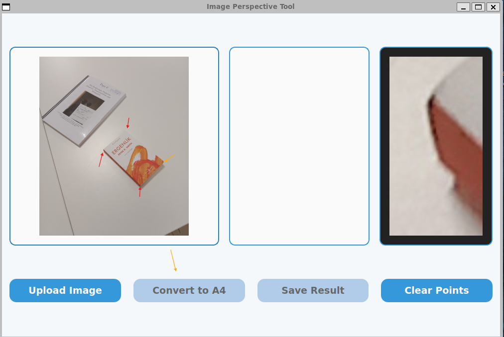
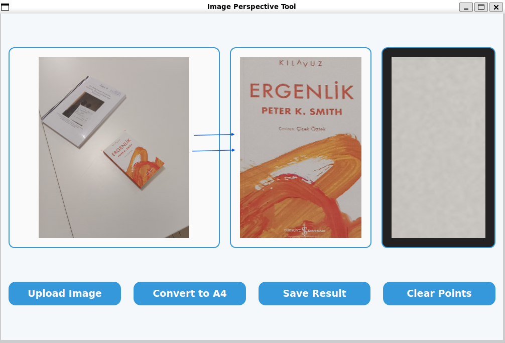

# Image Perspective Tool

## Description
A Qt-based GUI tool for correcting perspective distortion in images of documents or books, transforming them into A4-sized rectified images using homography.

## Features
- Upload image
- Select 4 corner points with magnifier assistance
- Apply perspective correction to A4 format
- Save processed image
- Clear selected points

## Dependencies
- Qt5 or later
- OpenCV
- Eigen library

## Build Instructions
1. Install dependencies.
2. Compile with CMake or Qt Creator using provided source files (MainWindow.cpp, homography.hpp, etc.).

## Usage
1. Launch the application. Interface appears empty.  
   

2. Click "Upload Image" and select a distorted image file.  
   

3. Click on 4 corner points of the document in the original image. Use magnifier for precision.  
   

4. Click "Convert to A4" to process. View rectified image. Click "Save Result" to export.  
   

Use "Clear Points" to reset selections.
